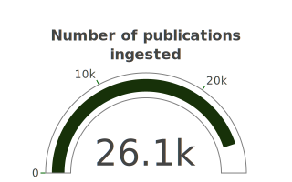

```{r setup, include=FALSE}
library(flexdashboard)
library(plotly)
library(widgetframe)

```

```{r data, include=FALSE}
pbdb <- readRDS(file.path("data", "pbdb.rds"))
pal <- c("#f0ffe9", "#ffe599", "#bbe487", "#4e9755", "#173109")
```

### Based on data in the **Paleobiology Database**, the majority of fossil collections are located in **North America** and **Europe**. A small portion also comes from the East Asian region. {data-commentary-width=300}

```{r sampling-gauge}
source("scripts/01-bubble_map.R")

fig_fn
```

***

{#id .class width=290px}

We only focus on publications published betweeen 1990 - 2020.

***
#### Proportions of fossil collections in:

- **Northern America:** `r round(sum(colls[colls$region == "Northern America",]$n)/sum(colls$n)*100,2)` %

- **Northern & Western Europe:** `r round(sum(colls[colls$region %in% c("Western Europe", "Northern Europe"),]$n)/sum(colls$n)*100,2)` %

- **East Asia:** `r round(sum(colls[colls$region == "Eastern Asia",]$n)/sum(colls$n)*100, 2)` %

<p><span style="float:right;">*Last updated 31 January 2021*.</span></p>

### The regions where the most sampled collections are, also tend to be **high income** countries with higher Gross Domestic Product (GDP) and available research funding. {data-commentary-width=400}

```{r circle-packing}
source("scripts/02-sunburst.R")

fig_sb
```

***

{#id .class width=24px} *Hover over the sections to see the details.*

The **darker regions** represents the regions, income classes or countries with the the **highest number of fossil collections**.

In general, regions like **Europe** and **Americas (mostly Northern America)** have the most number of fossil collections in their regions. Lower income countries, especially most of *Africa* and parts of *Asia* tend to have a lower number of fossil collections in the region.

### Chart C

```{r}

```

